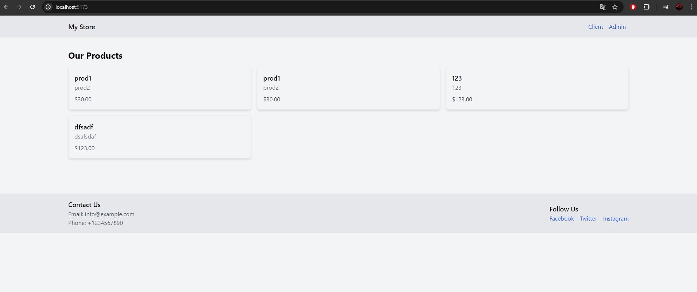
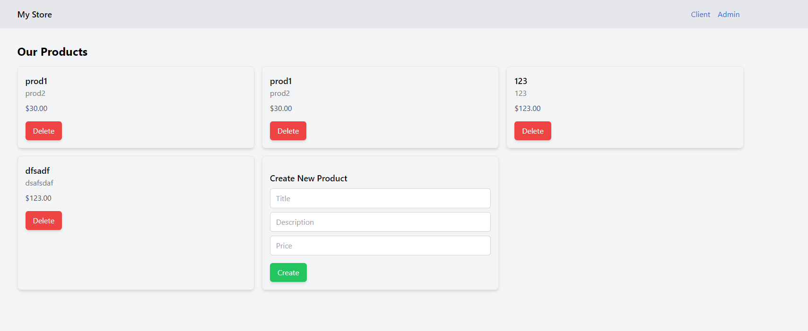

# Simple Fullstack Application

This project is a simple fullstack application using Nest.js, TypeORM, React, React-Router, Redux, and Tailwind CSS.

## Backend (API)

The backend is implemented with Nest.js and TypeORM, providing endpoints for managing products in a database.

### Structure

- **api/**: Contains the server-side application.
  - **src/Products/**: Main code handling product operations.
    - **controller**: Manages HTTP requests related to products.
    - **service**: Acts as a repository for product operations.
    - **module**: Nest.js module for product-related functionalities.

### Testing

- The controller and service components are unit-tested to ensure functionality and reliability.

## Frontend (React SPA)

The frontend is a React Single Page Application (SPA) with client and admin pages.

### Features

- **Client Page**: Allows users to view products.
- **Admin Page**: Enables administrators to create and delete products.

### Technologies Used

- **Redux**: State management for the frontend application.
- **Tailwind CSS**: Used for styling the user interface.

#### Screenshots

- Client View: 
- Admin View: 